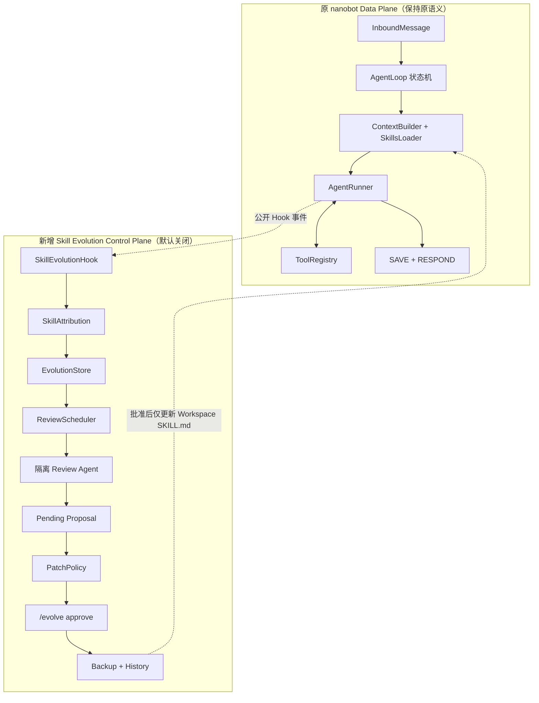
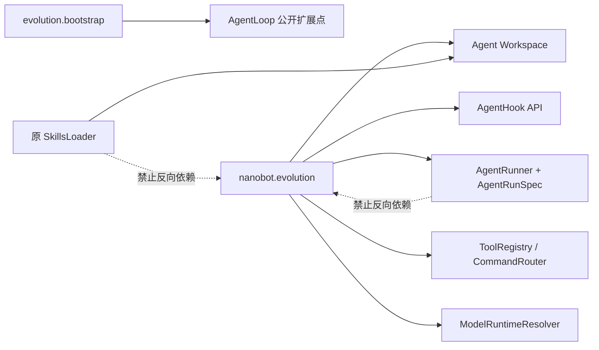
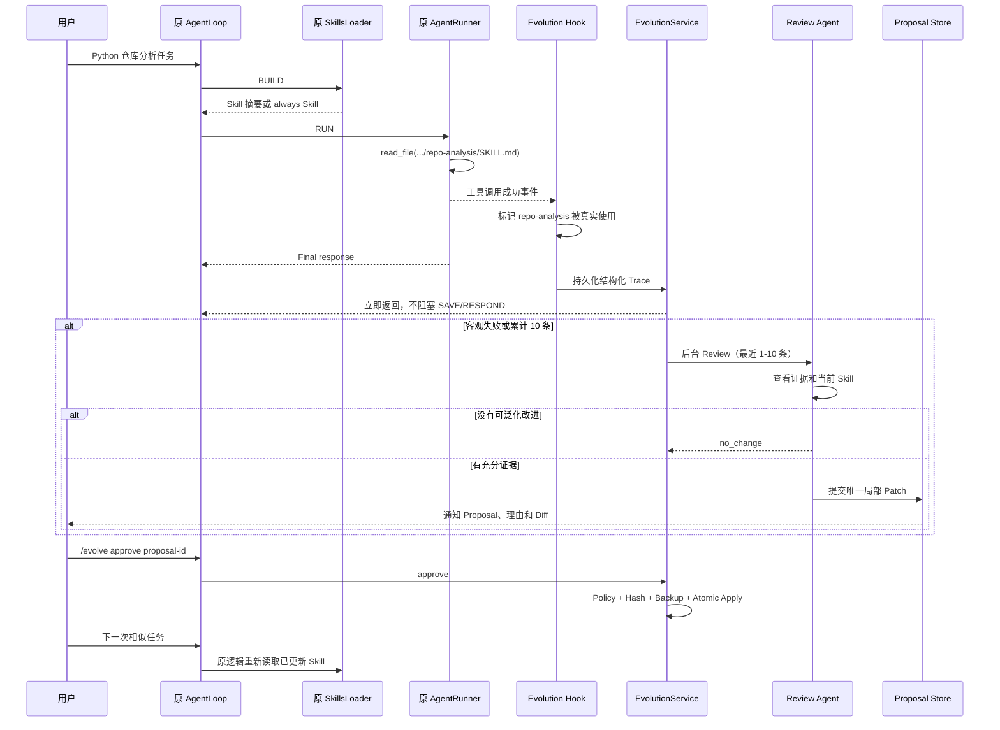

# Hermes-inspired Skill 自进化方案

> **归档快照**：本文件是 Hermes 对齐阶段的独立说明，内容已经合并到 `../../nanoevo-design.md` 和 `../../nanoevo-technical-architecture.md`。

> 结论：本方案确实借鉴 Hermes Agent，但不是照搬。
> 准确表述应是：**把 Hermes 的“任务后后台复盘 + 受限 Skill 管理”机制，适配为 nanobot 的“按 Skill 归因、仅修订已有 Workspace Skill、强制人工审批”的可选扩展。**

## 1. 先把“借鉴 Hermes”说准确

本文核对的本地源码基线：

| 项目 | Commit |
|---|---|
| Hermes Agent | `a97b6ff8f646f197efa14d405a1130c9951dcdd9` |
| nanobot | `089216f9c76741d2d767884ffa4e21e0389e00d9` |

Hermes 当前的 Skill 自改进不是一个“评测分数达到多少就晋升 Skill”的系统，也不是训练模型。它的真实逻辑是：

```text
正常任务执行
  → 统计使用工具的 Agent 迭代次数
  → 达到 nudge 阈值
  → 正常回答完成后，Fork 一个后台 Agent
  → 回放本次对话
  → 后台 Agent 使用受限的 Skill/Memory 管理工具复盘
  → 没有经验则不写；有经验则管理 Skill
```

源码依据：

| Hermes 机制 | 源码位置 | 实际行为 |
|---|---|---|
| Skill nudge 默认间隔 | `agent/agent_init.py:1701` | 默认 `10`，可由 `skills.creation_nudge_interval` 配置 |
| 计数方式 | `agent/conversation_loop.py:1158` | 每个工具调用迭代将 `_iters_since_skill` 加一 |
| Turn 结束触发 | `agent/turn_finalizer.py:633` | 达到阈值后设置 Review 标记并重置计数 |
| 后台复盘 | `agent/turn_finalizer.py:649` | 正常回答完成后异步启动，Best-effort，不让复盘失败破坏主任务 |
| Fork Agent | `agent/background_review.py` | 新建隔离的 `AIAgent`，回放对话快照 |
| 模型选择 | `agent/background_review.py:46` | 默认继承主模型，也可切换辅助 Review 模型 |
| 工具收窄 | `agent/background_review.py` | 后台 Agent 只保留 Memory/Skill 管理类工具 |
| Skill 管理 | `tools/skill_manager_tool.py` | 支持查看、创建、Patch、编辑、删除和支持文件 |
| 后台写保护 | `tools/skill_manager_tool.py:303` | 后台 Review 不能任意修改受保护或用户拥有的 Skill |
| 先读后写 | `tools/skill_manager_tool.py:426` | 后台 Agent 必须先查看目标 Skill，才能修改 |
| 可选审批 | `tools/write_approval.py` | 开启 `write_approval` 后把修改放入 Pending，再由用户审批 |
| 长期整理 | `agent/curator.py` | 独立 Curator 负责 Pin、Archive、Consolidate 等生命周期治理 |

因此，Hermes 的核心价值是：

> 把“完成任务”和“从任务中沉淀操作知识”拆成前台、后台两个阶段，并限制后台 Agent 的能力边界。

### 1.1 我们直接借鉴的四项设计

1. **主任务和复盘分离**
   正常 Agent 先完成用户任务，复盘是 Best-effort 后台工作。

2. **Fork 一个完整 Agent 做复盘**
   不用一个单次 LLM Judge 直接打分，而是让隔离的 Agent 查看证据、查看 Skill，再决定是否提出修改。

3. **默认复用主模型，允许切换 Review 模型**
   `reviewModelPreset=null` 时使用当前主模型；配置预设后使用独立模型，解析失败则回退主模型。

4. **Review Agent 只能使用受限工具**
   它没有 Shell、Web、MCP 和通用写文件能力，只能读取 Review 证据、读取目标 Skill、提交一个 Patch 提案。

### 1.2 为 nanobot 主动改造的部分

下面这些不是 Hermes 原样实现，而是为了你的时间、简历目标和安全边界做的收敛：

| 维度 | Hermes 当前设计 | nanobot-evo V1 |
|---|---|---|
| 触发计数 | 全局工具迭代次数 | 每个 Skill 的有效轨迹数 |
| Review 输入 | 对话消息快照 | 最近 10 条结构化 Skill 轨迹 |
| Skill 归因 | 根据对话中加载/查看的 Skill 判断 | `always: true` 或成功读取对应 `SKILL.md` |
| 修改对象 | Curator 管理的 Skill，可创建和管理支持文件 | 只修改已经存在的 Workspace Skill |
| 新建 Skill | 支持 | 禁止 |
| 修改内置 Skill | 受保护 | 永久禁止 |
| Patch 方式 | 支持模糊 Patch、编辑和文件管理 | 只允许唯一匹配的 `old_text/new_text` |
| 审批 | 可配置，默认并非强制 | 永远先生成 Pending Proposal，必须人工批准 |
| 长期 Curator | 有 Pin、Archive、Consolidate | V1 不做 |
| “效果评测” | 不以成功率为写入条件 | Runtime 不做分数门禁；另做离线真实仓库实验 |

所以简历和 README 中应该写：

> Inspired by Hermes Agent's post-turn background skill review mechanism.

不应该写：

> Reimplemented Hermes Agent's skill evolution system.

后者会夸大，因为我们的 V1 没有 Hermes Curator、Skill 创建、支持文件管理和完整生命周期。

## 2. nanobot-evo 到底是什么

原版 nanobot 是一个通用 Agent Runtime：

```text
消息 → AgentLoop → Context/Skills → AgentRunner → Tools → 回复
```

nanobot-evo 不把它变成另一个业务 Agent，也不改模型权重。它新增一个可选的 Skill 改进控制面：

```text
正常执行
  → 收集“已有 Skill 在真实任务里如何被使用”的客观证据
  → 后台复盘 Skill 是否存在可泛化缺陷
  → 生成局部修改提案
  → 用户批准
  → 后续任务加载修订后的 Skill
```

项目研究的问题是：

> Agent 能否把真实任务中的可观察经验，安全地沉淀为已有 Skill 的持续改进？

“自进化”在这里严格指：

> **Skill 文本层面的受控迭代，不是模型训练，不是 Agent 自动修改源代码。**

## 3. 总体架构：原 Data Plane 不动，新增 Evolution Control Plane



关键点：

- 原 `RESTORE → COMPACT → COMMAND → BUILD → RUN → SAVE → RESPOND` 状态机不增加新状态；
- 原 `AgentRunner` 不修改；
- 原 `SkillsLoader` 不修改；
- 原 Tool 执行逻辑不修改；
- 原 Channel、Provider、Memory、Session、WebUI 不修改；
- 关闭功能时不注册 Hook、Tool 和 Command；
- 开启功能后，主路径只多一次轻量事件记录，Review 不被主路径 `await`。

## 4. 解耦规则

### 4.1 依赖方向



必须遵守：

1. `nanobot/skills/` 和原 `SkillsLoader` 不 import `nanobot.evolution`；
2. `AgentRunner` 不知道“进化”概念；
3. 进化模块只依赖已有公开对象和 Agent Workspace；
4. `repo-analysis` 只是测试数据，核心代码中不能出现它的特殊分支；
5. 所有写操作先经过 `PatchPolicy`，Review Agent 不能直接写磁盘；
6. `enabled=false` 时，内存、Prompt、Tool 列表和运行结果应与原版一致。

### 4.2 Skills 与 Evolution 怎样解耦

两者只通过磁盘上的标准 Skill 契约连接：

```text
<agent-workspace>/skills/<skill-name>/SKILL.md
```

- 原 Skills 模块负责“发现和加载”；
- Evolution 模块负责“观察、提案、审批和版本记录”；
- Evolution 不改变 Skill 格式；
- Evolution 不要求 Skill 添加专用 Python 类；
- 批准前，Proposal 只存在于 `.nanobot/evolution/`，原 Skills 完全看不到；
- 批准后，Evolution 原子替换 Workspace `SKILL.md`；
- 下一次 BUILD 时，原 `SkillsLoader` 自然读取新内容。

这是一条单向关系：

```text
Evolution 经审批写标准 SKILL.md
                  ↓
        原 SkillsLoader 下次读取
```

原 Skills 模块不需要知道是谁修改了文件。

## 5. 模块划分

新增包：

```text
nanobot/evolution/
├── __init__.py
├── bootstrap.py
├── constants.py
├── models.py
├── redaction.py
├── attribution.py
├── hook.py
├── store.py
├── service.py
├── reviewer.py
├── policy.py
├── patching.py
├── tool.py
├── commands.py
└── prompts.py
```

| 模块 | 输入 | 输出 | 是否接触原主路径 |
|---|---|---|---|
| `bootstrap` | Config、AgentLoop | 已安装的扩展 | 只在组装期 |
| `hook` | Runner 生命周期事件 | 一条 Mutable Trace | 是，只观察 |
| `redaction` | 工具参数/结果 | 脱敏、截断内容 | 否 |
| `attribution` | Agent Workspace、工具事件 | 实际使用的 Skill 名称 | 否 |
| `store` | Trace、Review、Proposal | 原子持久化文件 | 否 |
| `service` | Hook/Command 请求 | 调度、状态转换、通知 | 否 |
| `reviewer` | 最近轨迹、目标 Skill | `no_change` 或 Proposal | 后台使用 Runner |
| `tool` | Review Agent 的 Patch 调用 | Pending Proposal | 否，不能应用 |
| `policy` | Skill、证据、Patch | 允许/拒绝及原因 | 否 |
| `patching` | 已批准 Proposal | Backup、Apply、Restore | 仅审批阶段写 Skill |
| `commands` | `/evolve ...` | 查询、复盘、审批、恢复 | 复用 CommandRouter |

V1 不需要为了“看起来更解耦”再创建一层抽象接口或引入依赖注入框架。使用构造函数传入 `workspace`、`store`、`runtime_resolver`、`bus` 和调度函数即可。

## 6. 与 nanobot 的四个串联点

### 6.1 组装点：`AgentLoop.from_config`

现状：

```python
return cls(...)
```

改进：

```python
loop = cls(...)
if config.evolution.enabled:
    install_skill_evolution(loop, config.evolution)
return loop
```

`install_skill_evolution()` 只做装配：

1. 创建 `EvolutionStore`；
2. 创建 `EvolutionService`；
3. 注册 `SkillEvolutionHookFactory`；
4. 注册主 Agent 可见的 `skill_manage(action="patch")`；
5. 注册 `/evolve` 命令。

不在这里放 Review、Patch 或持久化业务逻辑。

### 6.2 观察点：`AgentHook`

`SkillEvolutionHook` 使用原有回调：

| Hook | 记录内容 |
|---|---|
| `before_execute_tool` | Tool 名、脱敏参数、Iteration |
| `after_execute_tool` | 成功状态、截断结果 |
| `on_execute_tool_error` | 客观错误 |
| `after_run` | Final content、Stop reason、Usage |
| `on_finally` | 形成并持久化一次 Trace |

Hook 不做以下工作：

- 不调用模型；
- 不等待 Review；
- 不修改 Skill；
- 不改变工具结果；
- 不修改 Final response；
- 不保存隐藏 Thought/Chain-of-Thought。

Hook 只调用：

```python
service.observe(trace)
```

### 6.3 后台点：受跟踪的 Background Task

`service.observe()` 完成轻量归因和计数。如果需要 Review，则调用 AgentLoop 提供的通用后台调度方法：

```python
loop.schedule_background(service.review(skill_name, trigger))
```

为避免 Evolution 依赖 `_schedule_background` 私有字段，`AgentLoop` 只增加两个通用公开方法：

```python
def register_hook_factory(self, factory: AgentTurnHookFactory) -> None: ...
def schedule_background(self, coro: Coroutine[Any, Any, None]) -> None: ...
```

它们只是暴露 AgentLoop 已经存在的能力，不加入任何 Skill 业务语义。

Review 的启动时点是：

> 主 `AgentRunner` 已经得到最终结果后异步调度，正常 `SAVE/RESPOND` 不等待它。

这与 Hermes “任务后复盘”的意图一致，但 nanobot V1 不声称保证 Review 模型请求一定晚于网络层完成回复投递；它保证的是不阻塞正常回复链路。

### 6.4 生效点：下一次 `ContextBuilder.build_messages`

只有 `/evolve approve <id>` 成功后才执行：

```text
验证 Base Hash
  → 备份旧 SKILL.md
  → 精确替换 old_text
  → 校验 Frontmatter 和 Skill Name
  → 原子写入
  → 保存版本记录
```

下一次普通任务进入 BUILD 时，原 `SkillsLoader` 自然加载新版本。这里没有新增注入通道，也没有修改原 Prompt 构建规则。

## 7. 一次完整运行时序



## 8. Skill 使用归因

没有可靠归因，就不能说某条轨迹证明了某个 Skill 的问题。

V1 判定：

| 情况 | 是否算使用 |
|---|---|
| Workspace Skill 带 `always: true` 并被完整注入 | 是 |
| 正常 Skill 的 `SKILL.md` 被 `read_file` 成功读取 | 是 |
| 模型只看到了 Skill 名称和摘要 | 否 |
| `read_file` 调用失败 | 否 |
| 读取的是内置 Skill | 永远排除 |
| 读取的是普通项目 Markdown | 否 |

单次任务：

- 只使用一个 Workspace Skill：自动归因并参与触发；
- 使用多个 Workspace Skill：保存轨迹，但不自动把成败归因给某一个；
- 多 Skill 情况可由用户运行 `/evolve review <skill> [feedback]` 明确指定。

这样比 Hermes 的全局迭代 nudge 更适合做“某个 Skill 是否真的变好”的简历项目。

## 9. 触发与 Review

### 9.1 触发规则

| 触发 | 条件 | 输入 |
|---|---|---|
| 周期 Review | 某 Skill 新增 10 条可归因轨迹 | 最近 10 条 |
| 失败 Review | 单 Skill 轨迹发生客观失败 | 当前可用的最近 1-10 条 |
| 用户 Review | `/evolve review <skill> [feedback]` | 最近 10 条 + 用户反馈 |

客观失败只使用可观察事实，例如：

- Runner error；
- Stop reason 表示失败或耗尽迭代；
- 工具错误导致任务未完成；
- 明确的结构化失败标记。

不把“模型自称自己做得不好”直接当作客观失败。

每个 Skill 同一时刻最多一个 Review：

- 已在运行时，新触发只设置 `pending=true`；
- 本次结束后若仍满足条件，再合并运行一次；
- 不并发修改同一 Skill。

### 9.2 Review Agent

Review Agent 复用 `AgentRunner`，但使用独立 `ToolRegistry`：

```text
允许：
  - review_evidence(skill_name, trace_ids)
  - skill_view(skill_name)
  - skill_manage(action="patch", ...)

拒绝：
  - shell
  - web_search/web_fetch
  - MCP
  - 通用 read/write/edit
  - create/delete/rename Skill
  - 读取其他 Workspace 文件
  - 直接应用 Proposal
```

运行限制：

```text
max_iterations = 8
timeout = 60 seconds
max_proposals = 1
recursive_evolution = disabled
session_persistence = disabled
```

输出只有三类：

```text
no_change
proposal_created
review_failed / timed_out
```

Review 失败或超时只写日志和 Review 记录，不重试，不影响主任务。

### 9.3 Review 不是“打分评测”

Runtime 中不设计一个 LLM 分数，例如：

```text
planning_score = 8
tool_score = 6
```

原因是这些分数：

- 缺少稳定 Ground Truth；
- 同一模型既执行又评分容易自证；
- 一周内无法证明评分可靠；
- 与 Hermes 的实际机制也不一致。

这里的 Review 是：

> 根据轨迹证据，判断是否存在“能写进已有 Skill、对同类未来任务仍有价值”的改进。

真正用来证明项目效果的评测放在离线实验中，不作为自动写入门禁。

## 10. Patch 提案与安全门禁

Review Agent 只能提交：

```json
{
  "skill_name": "repo-analysis",
  "base_sha256": "...",
  "evidence_trace_ids": ["tr_001", "tr_002"],
  "patch": {
    "old_text": "旧的唯一片段",
    "new_text": "新的局部片段",
    "reason": "哪些轨迹证明该步骤缺失，以及为什么可泛化"
  }
}
```

确定性门禁：

1. 目标必须是 Agent Workspace 下已存在的 Workspace Skill；
2. 目标不能解析到内置、外部或符号链接逃逸路径；
3. 只能修改 `SKILL.md`；
4. `old_text` 非空且在当前文件中恰好出现一次；
5. `old_text != new_text`；
6. `base_sha256` 必须与当前文件一致；
7. 必须引用本次 Review 可见的 Trace ID；
8. 修改后 Frontmatter 可解析；
9. Skill `name` 不变；
10. 不出现绝对路径、凭据或仓库专属答案；
11. Patch 大小在 V1 上限内；
12. 一个 Review 最多产生一个 Proposal。

Proposal 的状态：

```text
pending
  ├── approved → applied
  ├── rejected
  ├── invalid
  └── conflict

applied → restored
```

`pending` Proposal 不会进入 Agent Prompt，也不会影响原 Skill。

## 11. 内置 Skill 和原功能怎样保证不受影响

### 11.1 默认关闭

```json
{
  "evolution": {
    "enabled": false,
    "reviewModelPreset": null
  }
}
```

默认关闭时：

- 不创建 `.nanobot/evolution/`；
- 不注册 Hook；
- 不注册 `skill_manage`；
- 不注册 `/evolve`；
- 不产生额外模型调用；
- 不改变工具列表；
- 不改变 Prompt；
- 不改变 Skill 加载；
- 不改变原响应。

### 11.2 内置 Skill 双重保护

第一层：归因时不收集内置 Skill。
第二层：PatchPolicy 根据解析后的真实路径再次拒绝非 Workspace Skill。

即使 Review Agent 伪造名称，也无法绕过第二层。

### 11.3 故障隔离

| 故障 | 主任务行为 |
|---|---|
| Trace 写入失败 | 记录日志，主回复继续 |
| Review 模型不可用 | 记录 failed，主回复不受影响 |
| Review 超时 | 取消 Review，主回复不受影响 |
| Review 产生非法 Patch | Proposal 标记 invalid，不修改 Skill |
| 用户同时编辑 Skill | Base Hash 冲突，不覆盖用户修改 |
| 应用过程失败 | 保留 Backup，原子写避免半文件 |
| 通知失败 | Proposal 仍可通过 `/evolve` 查询 |

Hook 的异常还会被原 `CompositeAgentHook` 隔离，不能把自进化异常传播到 Runner。

## 12. 原版与改进版完整对比

| 维度 | 原版 nanobot | nanobot-evo |
|---|---|---|
| 产品性质 | 轻量通用 Agent Runtime | 原 Runtime + 可选 Skill 改进控制面 |
| AgentLoop | 原状态机 | 不增加状态 |
| AgentRunner | 推理、工具调用和观察 | 完全不修改 |
| SkillsLoader | 发现、摘要和加载 Skill | 完全不修改 |
| Skill 来源 | 内置/Workspace Skill | 来源不变 |
| Skill 使用 | 加载后完成当前任务 | 额外记录是否被真实使用 |
| 经验 | 会话和 Memory | 新增面向 Skill 的结构化 Trace |
| 复盘 | 无专用 Skill Review | 后台隔离 Review Agent |
| 模型 | 主任务模型 | Review 默认复用，可切换 Preset |
| Skill 修改 | 用户或普通 Agent 手工维护 | 只提出已有 Workspace Skill 的局部 Patch |
| 新建 Skill | 原能力决定 | Evolution 永久禁止 |
| 内置 Skill | 可被加载 | Evolution 永久禁止修改 |
| 修改生效 | 文件保存后加载 | 人工批准、备份后，下次 BUILD 生效 |
| 安全 | 原 Workspace/Tool 规则 | 再加路径、哈希、证据、格式和审批门禁 |
| UI | CLI、Channel、WebUI | 不加页面，复用聊天 `/evolve` |
| 关闭功能 | 不适用 | 行为与原版相同 |
| 额外模型成本 | 无 Evolution 成本 | 只有触发 Review 时产生 |
| 效果证明 | 无专门实验 | 真实 Python 仓库前后对比 |

## 13. 文件改动边界

### 13.1 修改现有文件

| 文件 | 最小改动 | 原因 |
|---|---|---|
| `nanobot/config/schema.py` | 增加 `EvolutionConfig` | 默认关闭和 Review 模型配置 |
| `nanobot/agent/loop.py` | `from_config` 可选安装扩展；公开 Hook 注册和后台调度 | 只负责组装，不放进化业务 |

根据实际命令注册方式，可能只需要在现有 Command 注册入口增加一行安装调用；优先由 `bootstrap.py` 直接调用 `loop.commands.register(...)`，避免修改 Command 核心。

### 13.2 不修改

```text
nanobot/agent/runner.py
nanobot/agent/hook.py
nanobot/agent/context.py
nanobot/agent/skills.py
nanobot/agent/tools/registry.py
nanobot/providers/
nanobot/channels/
nanobot/session/
nanobot/agent/memory.py
webui/
```

### 13.3 新增

- `nanobot/evolution/`：完整 Control Plane；
- `tests/evolution/`：单元和集成测试；
- `examples/evolution/skills/repo-analysis/SKILL.md`：代表性已有 Skill；
- `benchmarks/repo_analysis/`：真实 Python 仓库离线实验；
- `docs/`：设计、实验和使用文档。

## 14. 一周执行计划（4 小时/天）

详细任务和测试命令见 [`skill-evolution-implementation-plan.md`](./skill-evolution-implementation-plan.md)。

| 天 | 目标 | 当天可验证产物 |
|---|---|---|
| Day 1 | Config、DTO、Store | 默认关闭；Trace/Proposal 可持久化 |
| Day 2 | Redaction、Attribution、Hook | 真实读取 Workspace Skill 后产生一条 Trace |
| Day 3 | PatchPolicy、Patching、Tool | 内置/新建/越界 Patch 被拒绝，合法提案进入 Pending |
| Day 4 | Review Agent、模型路由、Scheduler | 主模型/备用 Preset 可 Review，失败不影响主任务 |
| Day 5 | Bootstrap、Commands、E2E | `/evolve review/approve/reject/restore` 闭环 |
| Day 6 | 3 个真实 Python 仓库实验 | 2 个 Experience Repo + 1 个 Held-out Repo |
| Day 7 | 全量测试、README、Demo、简历材料 | 可复现结果、架构图、限制与演示 |

### 14.1 实现顺序为什么这样排

先做证据和安全，再接模型：

```text
数据模型/Store
  → 归因/Hook
  → Policy/Patch
  → Review Agent
  → Bootstrap/Command
  → 真实实验
```

这样即使 Day 4 的模型 Review 遇到 API 适配问题，前 3 天也已经形成可测试的核心基础，不会把项目全部压在 Prompt 上。

### 14.2 工期失控时的删减顺序

优先保留：

1. Hook 轨迹；
2. 单 Skill 归因；
3. 后台 Review；
4. Pending Proposal；
5. Approve + Backup；
6. 真实 Held-out 对比。

先删：

1. `restore` 命令的复杂版本选择，只保留恢复最近一版；
2. 主 Agent 主动调用 `skill_manage` 的入口，只保留后台 Review；
3. 额外的统计展示；
4. 失败即时触发，仅保留每 10 条和手动触发。

不能删：

- 默认关闭；
- 内置 Skill 禁止修改；
- 不创建新 Skill；
- 人工审批；
- Base Hash；
- 原 `AgentRunner`/`SkillsLoader` 零修改；
- 真实 API 和真实仓库验证。

## 15. 验收标准

### 15.1 兼容性

- `evolution.enabled=false` 的回归测试证明原行为不变；
- 原 nanobot 测试通过；
- `AgentRunner`、`SkillsLoader`、WebUI 无 Diff；
- Review 失败不会改变正常返回结果。

### 15.2 功能

- 单个 Workspace Skill 能被准确归因；
- 最近 10 条轨迹永久保存；
- 周期、失败和用户三种触发工作；
- Review 可返回 `no_change`；
- Review 最多产生一个局部 Proposal；
- Pending Proposal 不影响正常 Agent；
- Approve 后下一次 BUILD 读取新版；
- Reject 不修改；
- Restore 能恢复最近版本。

### 15.3 安全

- 不能修改内置 Skill；
- 不能创建 Skill；
- 不能修改多个文件；
- 不能符号链接逃逸；
- 不能绕过审批直接写；
- 并发人工编辑会产生 Conflict；
- Secret 不写入 Trace 或 Proposal。

### 15.4 简历证据

- 至少 3 个固定 Commit 的真实 Python 仓库；
- 使用真实 API/模型；
- 保留原始运行记录；
- Experience Repo 与 Held-out Repo 分开；
- 报告事实覆盖率、路径/入口准确率、无依据断言、工具调用和 Token；
- 不伪造“成功率提升”。

## 16. 最终对外表述

项目一句话：

> 基于 nanobot 实现一个受 Hermes Agent 启发的 Skill 自进化扩展：通过 Hook 采集已有 Workspace Skill 的真实执行轨迹，使用隔离的后台 Agent 生成证据驱动的局部修订提案，并通过审批、哈希冲突检测、备份恢复保证原 Agent 行为和 Skill 安全。

它解决的问题：

> 普通 Agent 每次完成任务后都会丢失操作层经验，已有 Skill 即使过时或不完整，也主要依赖人工发现和维护。

你的贡献：

1. 把 Hermes 的任务后复盘思想迁移到 nanobot 的 Hook 架构；
2. 设计精确的 Workspace Skill 使用归因；
3. 把开放式自动写入收敛成证据驱动的 Patch Proposal；
4. 通过人工审批、路径门禁、Base Hash、备份恢复降低 Skill 污染风险；
5. 用真实 Python 仓库和 Held-out 任务验证修订是否具有迁移价值。

这比“给 nanobot 加了一个 Skills 文件夹”准确得多，也比“实现了会自己成长的 Agent”更可信。
