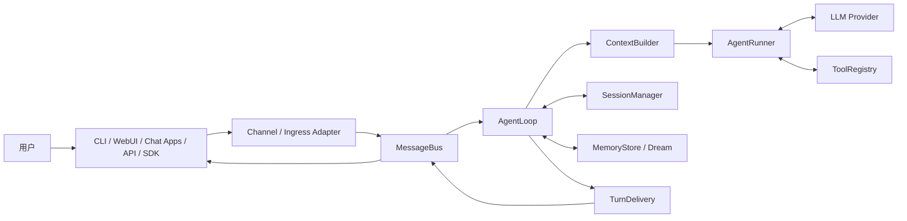
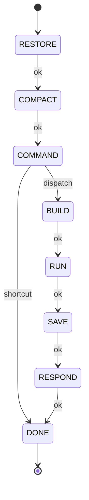

# nanobot 现有项目设计文档

> 分析基线：Git commit `089216f9c76741d2d767884ffa4e21e0389e00d9`
> 本文只描述当前仓库已经存在的设计，不包含 Skill 自进化扩展。

## 1. 项目定位

nanobot 是一个使用 Python 3.11+ 编写的轻量级个人 AI Agent Runtime。它不是某个固定业务 Agent，而是一套能够接收任务、构建上下文、调用大模型、执行工具、保存会话并通过多种渠道返回结果的运行框架。

它现有的主要产品能力包括：

- CLI 和 React/TypeScript WebUI；
- Telegram、Discord、Slack、微信、邮件等聊天渠道；
- 文件、Shell、Web、MCP、定时任务、图片生成和子 Agent 工具；
- 多模型 Provider、Model Preset 和 Fallback；
- Session、长期 Memory 和 Dream 记忆整理；
- Cron、Heartbeat、Trigger 和持续目标；
- Python SDK 和 OpenAI-compatible API；
- Workspace 访问限制、Shell Sandbox 和 SSRF 防护。

项目的设计原则是：

> 保持 Agent 核心较小，把新能力放到 Channel、Tool、Skill、Hook 或 MCP 等边缘扩展点。

## 2. 技术栈

| 范围 | 技术 |
|---|---|
| Agent Runtime | Python 3.11+、asyncio |
| 配置 | Pydantic、pydantic-settings |
| CLI | Typer、Rich、prompt-toolkit |
| LLM | Anthropic SDK、OpenAI SDK、OpenAI-compatible Provider |
| Web/Gateway | websockets，可选 aiohttp |
| WebUI | React、TypeScript、Vite |
| 持久化 | JSON、JSONL、Markdown、本地文件 |
| Tool 扩展 | Python 包扫描、Entry Point、MCP |
| 测试 | pytest、pytest-asyncio |
| 静态检查 | Ruff |

现有项目没有数据库依赖，主要状态均保存在配置的 Agent Workspace 中。

## 3. 系统上下文



核心依赖方向：

```text
外部入口
  → MessageBus
  → AgentLoop（Turn 编排）
  → AgentRunner（模型/工具循环）
  → Provider / Tool

AgentLoop
  → Context / Skills / Session / Memory
  → Command / Hook / Delivery
```

## 4. 顶层模块

| 模块 | 主要职责 | 关键文件 |
|---|---|---|
| Agent | Turn 状态机、模型工具循环、上下文、Skill、Hook、子 Agent | `nanobot/agent/` |
| Bus | Inbound/Outbound 事件和异步消息队列 | `nanobot/bus/` |
| Channels | 外部聊天平台适配、鉴权、消息收发 | `nanobot/channels/` |
| Providers | 模型调用、流式输出、重试、模型注册 | `nanobot/providers/` |
| Tools | 文件、Shell、Web、MCP 等 Agent 能力 | `nanobot/agent/tools/` |
| Session | 会话持久化、压缩、WebUI Turn 协调 | `nanobot/session/` |
| Memory | 长期记忆、历史、Dream Consolidation | `nanobot/agent/memory.py` |
| Config | 配置模型、加载、路径、热更新 | `nanobot/config/` |
| Commands | `/model`、`/goal`、`/skill` 等命令路由 | `nanobot/command/` |
| Gateway | 启动长期运行服务和运行时组件 | `nanobot/gateway/` |
| WebUI Backend | WebSocket、HTTP API、文件和设置接口 | `nanobot/webui/` |
| WebUI Frontend | React 聊天、设置、自动化管理界面 | `webui/` |
| API | OpenAI-compatible HTTP API | `nanobot/api/` |
| SDK | Python 调用封装 | `nanobot/sdk/`、`nanobot/nanobot.py` |
| Automation | Cron、Heartbeat、本地 Trigger | `nanobot/cron/`、`nanobot/triggers/` |
| Security | Workspace、网络和进程安全边界 | `nanobot/security/` |
| Skills | nanobot 自带的 Markdown 操作知识 | `nanobot/skills/` |

## 5. AgentLoop：Turn 编排层

`AgentLoop` 位于 `nanobot/agent/loop.py`，负责一个用户 Turn 从进入系统到返回结果的完整编排。

它不负责实现具体模型协议，也不实现具体工具逻辑。它负责：

- 从 `MessageBus` 接收 `InboundMessage`；
- 确定 Session Key；
- 对同一 Session 串行、不同 Session 并发；
- 解析有效 Project Workspace；
- 恢复中断状态；
- 触发自动压缩；
- 路由 Slash Command；
- 构建 System Prompt 和消息；
- 选择当前 Session 的模型 Runtime；
- 组装 Hook；
- 调用 `AgentRunner`；
- 保存消息、用量和运行状态；
- 通过 `TurnDelivery` 返回结果。

### 5.1 Turn 状态机



| 状态 | 责任 |
|---|---|
| `RESTORE` | 恢复被中断 Turn 的检查点和上下文 |
| `COMPACT` | 根据 Session 长度执行压缩 |
| `COMMAND` | 尝试处理 `/model`、`/goal` 等命令 |
| `BUILD` | 构建消息、System Prompt、Runtime Context |
| `RUN` | 调用 `AgentRunner` 执行模型/工具循环 |
| `SAVE` | 保存新消息、Token 用量和状态 |
| `RESPOND` | 产生并投递最终 Outbound 消息 |
| `DONE` | Turn 结束 |

### 5.2 并发模型

- 同一个 Session 使用 `asyncio.Lock` 串行执行；
- 不同 Session 可并行；
- 全局并发由 `NANOBOT_MAX_CONCURRENT_REQUESTS` 控制；
- Turn 执行期间的新消息可进入 Pending Queue；
- 后台任务由 `AgentLoop` 跟踪，并在关闭时统一等待。

## 6. AgentRunner：模型与工具执行层

`AgentRunner` 位于 `nanobot/agent/runner.py`，负责模型面对的迭代循环：

```text
messages
  → Context Governance
  → Provider Request
  → LLM Response
  → 有 Tool Call？
      ├─ 是：校验参数 → 执行工具 → Observation 回填 → 下一轮
      └─ 否：输出 Final Content → 结束
```

主要职责：

- 调用 `LLMProvider`；
- 处理流式文本和 Reasoning；
- 累计 Token Usage；
- 解析并执行 Tool Call；
- 支持多个可并发工具；
- 截断过长工具结果；
- 处理模型重试、长度恢复和消息注入；
- 生成 `AgentRunResult`；
- 在各阶段调用 Hook。

`AgentRunner` 接收 `AgentRunSpec`，而不是直接读取全局配置。这使它可以被主 Agent、子 Agent或其他受限运行场景复用。

## 7. ContextBuilder：上下文构建

`ContextBuilder` 位于 `nanobot/agent/context.py`，负责把分散的信息组合为模型上下文。

System Prompt 主要由以下内容组成：

1. Agent Identity 和平台策略；
2. Project/Agent Workspace 信息；
3. `AGENTS.md`、`SOUL.md`、`USER.md` 等 Bootstrap 文件；
4. Tool Contract；
5. 长期 Memory；
6. `always: true` 的 Skill 全文；
7. 其他 Skill 的摘要和路径；
8. 最近 Memory History；
9. Session Summary；
10. 当前 Turn 的 Runtime Context。

### 7.1 Runtime Context

`nanobot/runtime_context.py` 定义 `RuntimeContextBlock`。Tool 或其他组件可以在每个 Turn 开始前提供短暂上下文，而不修改全局 Prompt 模板。

适合放置：

- 当前工具的使用约束；
- 本 Turn 的临时能力说明；
- WebUI 引用内容；
- 持续目标状态。

不适合放置：

- 永久记忆；
- 大段历史；
- 未截断工具输出；
- 需要用户可编辑的长期规则。

## 8. Skill 系统

`SkillsLoader` 位于 `nanobot/agent/skills.py`。

Skill 是带 YAML Frontmatter 的 Markdown 文件，用来向 Agent 提供“如何完成某类任务”的操作知识。

### 8.1 两类 Skill

```text
内置 Skill：
<repository>/nanobot/skills/<name>/SKILL.md

Workspace Skill：
<agent-workspace>/skills/<name>/SKILL.md
```

同名时 Workspace Skill 优先，内置版本被遮蔽。

### 8.2 加载策略

- `always: true`：完整内容直接进入 System Prompt；
- 普通 Skill：只把名称、描述和路径放入摘要；
- Agent 判断需要时，再用 `read_file` 读取完整 `SKILL.md`；
- Disabled 或缺少运行要求的 Skill 不参与正常加载。

这是 Progressive Loading，避免所有 Skill 全文同时污染上下文。

### 8.3 Skill 与 Memory 的区别

| Skill | Memory |
|---|---|
| 面向一类任务的可复用操作流程 | 用户、历史和长期事实 |
| 结构化 Markdown 能力说明 | `MEMORY.md` 和 `history.jsonl` |
| 通常由用户安装或维护 | 由会话和 Dream 逐步整理 |
| 决定“怎么做” | 保存“发生过什么、用户偏好什么” |

当前项目没有“依据真实执行轨迹自动修改已有 Skill”的闭环。

## 9. Tool 系统

Tool 体系位于 `nanobot/agent/tools/`。

### 9.1 Tool 基类

每个 Tool 提供：

- `name`；
- `description`；
- JSON Schema 参数；
- `execute()`；
- `read_only`、`exclusive`、`concurrency_safe`；
- `enabled()` 和 `create()`；
- 可选 `runtime_context_provider()`。

### 9.2 ToolRegistry

`ToolRegistry` 负责：

- 注册和注销 Tool；
- 输出稳定排序的模型 Tool Definition；
- 参数类型转换和校验；
- 执行 Tool；
- 收集 Tool 提供的 Runtime Context。

### 9.3 ToolLoader

`ToolLoader` 使用两种方式发现 Tool：

1. 扫描 `nanobot.agent.tools` 包；
2. 加载 `nanobot.tools` Python Entry Point。

需要共享 Runtime State 的 Tool 可以像 `MyTool` 一样，在 `AgentLoop` 装配阶段手动注册。

### 9.4 RequestContext

工具通过 ContextVar 获得当前请求的不可变快照：

- Channel；
- Chat ID；
- Message ID；
- Session Key；
- 原始用户文本；
- 当前 `LLMRuntime`；
- Sender；
- Turn ID；
- 有效 Project Workspace。

这允许共享 ToolRegistry 服务多个并发 Turn，而不把每个请求的状态写进 Tool 实例。

## 10. Hook 系统

Hook 定义在：

- `nanobot/agent/hook.py`
- `nanobot/agent/turn_hooks.py`

可观察的生命周期包括：

- `before_run`
- `after_run`
- `on_error`
- `on_finally`
- `before_iteration`
- `after_iteration`
- `before_execute_tool`
- `after_execute_tool`
- `on_execute_tool_error`
- Stream 和 Reasoning 事件

`build_agent_turn_hook()` 把 Progress Hook、全局 Hook Factory、Turn Hook 和临时 Hook 组合为 `CompositeHook`。

`CompositeHook` 会隔离单个扩展 Hook 的异常，避免普通扩展破坏 Agent 主流程。

Hook 是本项目最合适的行为观测扩展点。

## 11. Provider 与模型路由

Provider 模块位于 `nanobot/providers/`，共同实现 `LLMProvider` 接口。

现有能力：

- Anthropic；
- OpenAI-compatible；
- OpenAI Responses API；
- Azure OpenAI；
- AWS Bedrock；
- GitHub Copilot；
- OpenAI Codex；
- Provider Fallback；
- 自定义 Provider。

`ModelRuntimeResolver` 负责把配置解析为不可变 `LLMRuntime`：

- 当前默认 Runtime；
- Session 选择的 Model Preset；
- 动态配置刷新；
- 在不修改默认模型的情况下解析指定 Preset。

因此后台任务可以复用主模型，也可以选择独立 Review Preset。

## 12. MessageBus、Channel 与 Delivery

### 12.1 MessageBus

`MessageBus` 解耦外部 Channel 与 Agent Core：

- Channel 发布 `InboundMessage`；
- `AgentLoop` 消费；
- Agent 产生 `OutboundMessage`；
- 对应 Channel 发送结果。

### 12.2 Channel

每个 Channel 是相对独立的适配包，负责：

- 平台连接；
- 消息格式转换；
- Allowlist/Pairing；
- 媒体处理；
- 流式输出；
- 平台特有错误恢复。

### 12.3 TurnDelivery

`TurnDelivery` 处理一次 Turn 的进度、流式文本、完成状态和最终消息投递，避免 Channel 协议细节进入 `AgentLoop`。

## 13. Session、Memory 与持久化

### 13.1 Session

`SessionManager` 保存：

- 会话消息；
- Session Metadata；
- Model Preset；
- Runtime Checkpoint；
- 压缩摘要；
- Token 使用信息。

Session 主要使用 JSONL/JSON 文件，并提供原子写入和恢复机制。

### 13.2 Memory

Memory 包含：

- `memory/MEMORY.md`：长期整理后的记忆；
- `memory/history.jsonl`：待整理或近期历史；
- Dream：周期性整理 Memory；
- Raw Archive：历史归档。

### 13.3 默认路径

```text
~/.nanobot/config.json
~/.nanobot/workspace/
├── sessions/
├── memory/
├── skills/
├── SOUL.md
├── USER.md
└── HEARTBEAT.md
```

## 14. Command 系统

`CommandRouter` 支持三类路由：

1. Priority Exact；
2. Normal Exact；
3. Longest-prefix-first。

现有命令包括：

- `/new`
- `/status`
- `/model`
- `/history`
- `/goal`
- `/trigger`
- `/dream`
- `/skill`
- `/pairing`
- `/help`

Slash Command 在 `COMMAND` 状态处理。纯管理命令可以直接结束，不需要进入模型执行。

## 15. Automation 与子 Agent

### 15.1 Automation

- Cron：用户定义的定时 Turn；
- Heartbeat：读取 `HEARTBEAT.md` 的周期检查；
- Local Trigger：外部本地程序向已有 Session 投递任务；
- Sustained Goal：跨多个 Turn 持续推进目标。

### 15.2 SubagentManager

`SubagentManager` 复用 Agent Runtime 创建子 Agent，管理：

- Workspace；
- Provider/Model；
- Tool Scope；
- 最大迭代；
- Session；
- 并发数量；
- 生命周期和结果回传。

它默认面向普通任务型子 Agent。需要严格工具白名单的后台审查，应复用 `AgentRunner` 模式，但建立独立 `ToolRegistry`，而不是直接使用普通子 Agent 的宽权限配置。

## 16. WebUI、API 与 SDK

### 16.1 WebUI

前端位于 `webui/`，后端适配位于 `nanobot/webui/` 和 WebSocket Channel。

WebUI 提供：

- Chat；
- Session 管理；
- Workspace 选择；
- 文件预览；
- Settings；
- Skill 查看；
- Automation 管理；
- Token 使用展示。

### 16.2 API

`nanobot/api/` 提供 OpenAI-compatible Chat Completions 接口，适合外部程序接入。

### 16.3 SDK

Python SDK 提供：

- Agent 调用；
- Session 导入、导出、清理；
- Memory 读写；
- Runtime 控制；
- 流式结果。

这些入口最终都尽量复用 `AgentLoop.from_config()`，因此它是全局功能装配的合适位置。

## 17. 配置设计

根配置位于 `nanobot/config/schema.py`。

设计特点：

- Pydantic 类型校验；
- Python 使用 snake_case；
- JSON 默认序列化为 camelCase；
- 支持 `${ENV_VAR}` Secret 引用；
- Provider、Agent、Channel、Gateway、Tool 分区；
- Model Preset 是推荐的模型配置方式。

所有新增运行行为应显式进入配置模型，不能依赖隐藏环境变量或隐式自动开启。

## 18. Workspace 与安全边界

nanobot 区分两个 Workspace：

| Workspace | 归属内容 |
|---|---|
| Agent Workspace | Session、Memory、用户 Skill、SOUL/USER 等 Agent 状态 |
| Effective Project Workspace | 当前项目文件、Shell 工作目录、项目 `AGENTS.md` |

WebUI 可以为一个 Session 选择不同 Project Workspace，所以两者不一定相同。

安全模块负责：

- 文件路径包含校验；
- 读写能力分离；
- Shell Workspace 限制；
- 可选 `bwrap` Sandbox；
- SSRF 目标校验；
- Channel Pairing 和 Allowlist。

任何修改 Workspace Skill 的功能必须使用 Agent Workspace，不能误用当前 Project Workspace。

## 19. 当前扩展点总结

| 需求 | 合适扩展点 |
|---|---|
| 观察 Agent 行为 | `AgentHook` / `AgentTurnHookFactory` |
| 添加一个模型可调用动作 | `ToolRegistry` |
| 给每个 Turn 注入短规则 | `RuntimeContextProvider` |
| 添加聊天管理命令 | `CommandRouter` |
| 使用独立模型配置 | `ModelRuntimeResolver.resolve_preset()` |
| 运行隔离审查 Agent | `AgentRunner` + 独立 `ToolRegistry` |
| 向原聊天发送通知 | `MessageBus.publish_outbound()` |
| 持久化轻量状态 | Agent Workspace 下 JSON/JSONL |
| 后台任务生命周期 | `AgentLoop` Background Task Tracking |

## 20. 对 Skill 自进化设计的直接约束

基于现有架构，新功能应遵守：

1. 不修改 `AgentRunner` 主循环；
2. 不修改 `SkillsLoader` 的加载优先级；
3. 不让 Provider、Channel 和 WebUI 感知进化业务；
4. 使用 Hook 观察，而不是复制执行逻辑；
5. 使用独立受限 ToolRegistry 运行 Review；
6. 使用配置的 Agent Workspace 管理 Skill；
7. 默认关闭；
8. 所有失败不能影响正常 Turn；
9. 新版 Skill 通过下一次 Context Build 自然生效；
10. 保持本地文件持久化，不增加数据库和新依赖。
