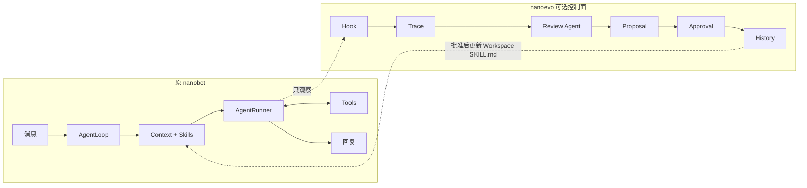

# nanobot 与 nanoevo 对比

> 本文只说明 nanoevo 在原 nanobot 上增加了什么、保留了什么，以及两个项目分别解决什么问题。
> 原版架构见 [`nanobot-current-architecture.md`](./nanobot-current-architecture.md)，改进版设计见 [`nanoevo-design.md`](./nanoevo-design.md)。

## 1. 一句话区别

原版 nanobot：

> 一个轻量级通用 Agent Runtime，让模型能够加载上下文、调用工具并通过多种 Channel 完成任务。

nanoevo：

> 在原 nanobot 外增加一个可选的 Skill 改进控制面，让已有 Workspace Skill 能依据真实任务证据持续产生受控修订。

它不是把 nanobot 改成某个 Python 仓库分析机器人。`repo-analysis` 只是用于证明机制的代表性 Skill。

## 2. 原版解决什么问题

nanobot 的核心链路：

```text
Channel
→ MessageBus
→ AgentLoop
→ ContextBuilder / SkillsLoader
→ AgentRunner
→ ToolRegistry
→ Session / Memory
→ OutboundMessage
```

它解决：

- 如何接收不同聊天平台的消息；
- 如何构建 Agent 上下文；
- 如何接入不同 LLM Provider；
- 如何运行模型—工具—观察循环；
- 如何管理 Session 和 Memory；
- 如何扩展 Tool、Channel、MCP 和 Skill；
- 如何通过 CLI、API 和 WebUI 使用 Agent。

原版没有专门解决：

> 一个已有 Skill 在真实任务中暴露问题后，如何自动收集证据、提出安全修订并验证迁移效果？

## 3. nanoevo 增加什么



nanoevo 新增：

1. Skill 实际使用归因；
2. 脱敏结构化轨迹；
3. 每 Skill 的 Review 调度；
4. 隔离后台 Review Agent；
5. 两条独立证据门槛；
6. Patch-only `skill_manage`；
7. Pending Proposal；
8. 人工审批；
9. Base Hash 冲突检测；
10. Backup 和 Restore；
11. 真实 Python 仓库离线对比。

## 4. 完整能力对比

| 维度 | 原版 nanobot | nanoevo |
|---|---|---|
| 产品定位 | 轻量通用 Agent Runtime | 原 Runtime + Skill 自进化控制面 |
| 用户任务 | 通用聊天、工具调用和自动化 | 完全保留 |
| AgentLoop | 原状态机 | 状态机不变 |
| AgentRunner | 模型—工具执行循环 | 完全复用、不修改 |
| SkillsLoader | 发现、摘要、加载 Skill | 完全复用、不修改 |
| Skill 来源 | 内置 Skill、Workspace Skill | 来源不变 |
| Skill 使用 | 为当前任务提供操作说明 | 额外判断 Skill 是否真实参与 |
| 轨迹 | 普通运行日志和会话 | 新增面向 Skill 的结构化证据 |
| Skill 改进 | 主要依赖人工维护 | 后台 Agent 自动提出局部 Patch |
| Proposal 证据 | 无专门规则 | 两个不同任务的独立证据；用户明确纠正例外 |
| 修改已有 Skill | 通过既有文件工具或人工操作 | 受控 Patch Proposal |
| 创建新 Skill | 原工具能力决定 | Evolution 模块禁止 |
| 修改内置 Skill | 可加载、受原权限控制 | Evolution 永久禁止写入 |
| 修改生效 | 文件改变后加载 | 审批、校验、备份后，下次 BUILD 生效 |
| 后台模型 | 无专用 Skill Reviewer | 默认主模型，可切换 Preset |
| 故障隔离 | 原 Hook/Runner 规则 | Review 失败不影响主回复 |
| 状态审计 | Session/Memory/日志 | Trace、Review、Proposal、History |
| 回滚 | 无 Skill 专用流程 | Restore 最近已应用版本 |
| WebUI | 原 WebUI | 不新增页面 |
| 用户入口 | CLI、Channel、WebUI、API | 原入口 + `/evolve` 命令 |
| 实验 | 无专门 Skill 迁移实验 | Experience/Held-out Python 仓库对比 |

## 5. 正常任务前后对比

### 5.1 原版

```text
任务
→ 加载 Skill
→ Agent 执行
→ 返回结果
→ 任务结束
```

即使 Skill 的步骤导致错误，下一次仍然加载相同内容，除非人工修改。

### 5.2 改进版

```text
任务
→ 原逻辑加载 Skill
→ 原 AgentRunner 执行
→ Hook 保存客观轨迹
→ 后台判断是否有可泛化缺陷
→ no_change 或 Pending Proposal
→ 用户批准
→ 下一次原 SkillsLoader 读取修订版
```

关键变化不在任务执行阶段，而在任务结束后的知识治理阶段。

## 6. 保持不变的部分

nanoevo V1 不修改：

```text
nanobot/agent/runner.py
nanobot/agent/skills.py
nanobot/agent/context.py
nanobot/agent/hook.py
nanobot/agent/tools/registry.py
nanobot/providers/
nanobot/channels/
nanobot/session/
nanobot/agent/memory.py
webui/
```

继续复用：

- `AgentHook` 生命周期；
- `AgentRunner` 和 `AgentRunSpec`；
- `ToolRegistry`；
- `CommandRouter`；
- `ModelRuntimeResolver`；
- `MessageBus`；
- `ContextBuilder/SkillsLoader`；
- Agent Workspace；
- AgentLoop 已有后台任务跟踪。

## 7. 原有文件的最小改动

| 文件 | 改动 |
|---|---|
| `nanobot/config/schema.py` | 增加默认关闭的 `EvolutionConfig` |
| `nanobot/agent/loop.py` | 可选安装扩展；公开通用 Hook 注册和后台调度 |

新增业务集中在：

```text
nanobot/evolution/
```

这使依赖保持单向：

```text
evolution → nanobot 公开扩展机制
```

禁止出现：

```text
AgentRunner → evolution
SkillsLoader → evolution
Provider/Channel → evolution
```

## 8. 关闭 nanoevo 时的对比

配置：

```json
{
  "evolution": {
    "enabled": false,
    "reviewModelPreset": null
  }
}
```

关闭时：

- 不注册 Evolution Hook；
- 不注册 `skill_manage`；
- 不注册 `/evolve`；
- 不创建 Evolution 存储；
- 不产生额外模型请求；
- 不改变 Prompt；
- 不改变 Tool 列表；
- 不改变正常响应；
- 不改变 Skill 加载。

因此兼容性验收必须证明：

> 默认配置下，nanoevo 的运行行为等价于原 nanobot。

## 9. 项目价值对比

原 nanobot 展示：

- Agent Loop；
- 工具调用；
- Provider/Channel 扩展；
- Session、Memory 和 Skills；
- 通用 Agent 工程能力。

nanoevo 进一步展示：

- 执行轨迹归因；
- Agent 任务后反思；
- 显式能力的持续迭代；
- 后台 Agent 隔离；
- Prompt Injection 和长期知识污染防护；
- 人在环审批；
- 版本冲突和恢复；
- Held-out 实验设计。

所以简历叙事不是：

> Fork nanobot 增加了几个命令。

而是：

> 在保持原 Agent Runtime 兼容性的前提下，设计并实现一个证据驱动的已有 Skill 自进化控制面。

## 10. 边界总结

```text
nanobot 负责：把任务完成
nanoevo 负责：从任务证据中安全地改进已有操作知识
```

```text
原 SkillsLoader 负责：读取 Skill
Evolution 负责：产生、审批和应用修订
```

```text
Runtime Review 负责：判断是否值得提出修改
离线实验负责：判断修改是否真的更好
```

真实单次 Held-out 实验中，`repo-analysis` Skill 的路径引用准确率从 77.8%
提升到 93.3%，但必需信息召回率从 100.0% 降到 83.3%，Tool Calls 和 Token
成本也上升。因此当前结论是“闭环有效、局部指标改善、存在明确权衡”，而不是
“Agent 全面变强”。完整原始结果见
[`experiments/nanoevo/results/agnes-2.0-flash-20260726.json`](../experiments/nanoevo/results/agnes-2.0-flash-20260726.json)。
