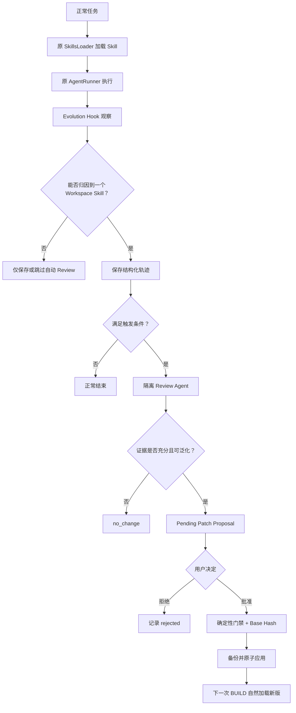

# nanoevo 设计文档

> 状态：V1 实现基线
> 项目定位：在不改变 nanobot 原 Agent 执行语义的前提下，增加一个受 Hermes Agent 启发、证据驱动、需人工批准的已有 Workspace Skill 自进化闭环。

## 1. 文档导航

- 当前 nanobot：[`nanobot-current-architecture.md`](./nanobot-current-architecture.md)
- 原版与改进版对比：[`nanobot-vs-nanoevo.md`](./nanobot-vs-nanoevo.md)
- 代码级技术架构：[`nanoevo-technical-architecture.md`](./nanoevo-technical-architecture.md)
- 七天执行计划：[`nanoevo-implementation-plan.md`](./nanoevo-implementation-plan.md)

本文只回答四个问题：

1. nanoevo 为什么存在；
2. 它从 Hermes Agent 借鉴了什么；
3. Skill 如何发生一次受控进化；
4. V1 做什么、不做什么以及怎样证明有效。

## 2. 问题与目标

原版 nanobot 已经能够：

- 接收任务；
- 构建上下文；
- 加载 Skill；
- 调用模型和工具；
- 保存 Session/Memory；
- 返回结果。

但已有 Skill 主要依靠人工维护。即使 Agent 在真实任务中发现某个 Skill 的步骤过时、缺少关键检查或容易导致错误，这些经验也不会自动沉淀回 Skill。

nanoevo 解决的问题是：

> Agent 如何根据已有 Workspace Skill 的真实使用轨迹，发现可泛化缺陷，并安全地产生可审查、可拒绝、可恢复的局部修订？

“自进化”的严格含义：

> 根据执行证据持续修订显式的 Skill 操作知识。

它不表示：

- 训练模型；
- 修改模型参数；
- 自动修改 nanobot Python 源码；
- 让 Agent 无限制重写自身；
- 自动创造任意新能力。

## 3. 从 Hermes Agent 借鉴什么

核对基线：

| 项目 | Commit |
|---|---|
| Hermes Agent | `a97b6ff8f646f197efa14d405a1130c9951dcdd9` |
| nanobot | `089216f9c76741d2d767884ffa4e21e0389e00d9` |

Hermes 的核心思想是把 Agent 分为两个循环。

### 3.1 快循环：完成任务

```text
用户任务 → 模型 → 工具 → 观察 → 返回结果
```

它只回答：

> 当前任务下一步应该做什么？

### 3.2 慢循环：任务后学习

```text
任务完成 → 后台复盘 → 提取可复用经验 → 管理 Skill
```

它回答：

> 这次任务中有没有值得长期保留的操作方法？

Hermes 当前源码中的关键机制：

| 机制 | Hermes 源码 | 行为 |
|---|---|---|
| Nudge 阈值 | `agent/agent_init.py` | 默认每 10 次工具调用迭代考虑 Review |
| Turn 结束触发 | `agent/turn_finalizer.py` | 主任务结束后 Best-effort 启动后台复盘 |
| Fork Agent | `agent/background_review.py` | 隔离 Agent 回放对话，不修改主会话 |
| 模型路由 | `agent/background_review.py` | 默认主模型，可配置辅助 Review 模型 |
| 工具收窄 | `agent/background_review.py` | 后台只使用 Memory/Skill 管理工具 |
| Skill 修改 | `tools/skill_manager_tool.py` | 支持查看、Patch、创建、删除和支持文件 |
| 写入审批 | `tools/write_approval.py` | 开启审批时先进入 Pending |
| 长期治理 | `agent/curator.py` | Pin、Archive、Consolidate 等生命周期管理 |

nanoevo 直接借鉴：

1. 正常任务和能力沉淀分离；
2. Fork 完整但隔离的 Agent 做 Review；
3. 默认复用主模型，同时允许切换 Review 模型；
4. Review Agent 只能使用最小工具白名单；
5. Review 是 Best-effort，失败不能破坏主任务。

## 4. 为什么不照搬 Hermes

Hermes 是完整的长期 Skill 治理系统，而本项目只有一周、约 28 小时，并且目标是形成一个容易解释、容易验证的简历项目。

因此 V1 主动收敛：

| Hermes | nanoevo V1 |
|---|---|
| 全局工具迭代触发 | 每个 Skill 单独累计轨迹 |
| 回放完整对话 | 使用最近 10 条结构化、脱敏轨迹 |
| 可创建 Skill | 禁止创建 |
| 可删除 Skill | 禁止删除 |
| 可修改支持文件 | 只修改现有 `SKILL.md` |
| 可自动管理 Curator Skill | 所有 Proposal 必须人工批准 |
| 有 Curator 生命周期 | V1 不做归档、合并和 Pin |
| 模糊 Patch/完整编辑 | 唯一匹配的局部 `old_text/new_text` |
| 主要判断有没有经验 | 额外要求 Skill 使用归因和独立证据 |

准确对外表述：

> Hermes-inspired post-turn skill review for nanobot.

不应表述为：

> 完整复刻 Hermes 的 Skill Evolution/Curator。

## 5. 产品边界

### 5.1 V1 必须完成

1. 观察正常 Agent 的可见工具轨迹；
2. 判断本次任务实际使用了哪个 Workspace Skill；
3. 永久保存脱敏轨迹；
4. 根据周期、客观失败或用户命令启动后台 Review；
5. Review 可以返回 `no_change`；
6. 有充分证据时只生成一个局部 Patch Proposal；
7. Proposal 必须由用户批准或拒绝；
8. 批准前进行路径、证据、Hash 和文档格式校验；
9. 应用前备份，应用后支持恢复；
10. 下一次任务通过原 SkillsLoader 自然加载新版；
11. 用真实 Python 仓库验证改进是否可迁移。

### 5.2 V1 明确不做

- 不创建新 Skill；
- 不修改内置 Skill；
- 不修改外部或 Hub 安装的 Skill；
- 不自动批准；
- 不修改源码；
- 不保存隐藏思维链；
- 不做 RL、SFT 或模型训练；
- 不做多 Agent 平台；
- 不做 Skill Curator；
- 不做新的 WebUI 页面；
- 不使用 LLM 的 1–10 分作为写入门禁；
- 不支持多文件 Patch；
- 不把仓库专属答案写进 Skill。

## 6. Skill 自进化闭环



闭环可拆成八个阶段。

### 6.1 使用归因

只有确认 Skill 真实参与任务，才能把轨迹用作修改它的证据。

| 情况 | 是否算使用 |
|---|---|
| Workspace Skill 为 `always: true` 并被完整注入 | 是 |
| Agent 成功读取 Workspace `<skill>/SKILL.md` | 是 |
| 只看到 Skill 名称和摘要 | 否 |
| `read_file` 失败 | 否 |
| 读取内置 Skill | 永远排除 |
| Review Agent 自己读取 Skill | 不进入普通轨迹 |

自动归因：

- 使用 0 个 Workspace Skill：不触发 Skill Review；
- 使用 1 个：允许自动归因；
- 使用多个：保存轨迹，但不自动判断哪个 Skill 应负责。

多 Skill 情况必须由用户明确指定：

```text
/evolve review <skill> [feedback]
```

### 6.2 结构化轨迹

轨迹记录：

- `trace_id`、`turn_id`、时间；
- 原始任务的脱敏摘要；
- 实际使用的 Workspace Skill；
- 工具名、脱敏参数、成功/失败和结果摘要；
- Stop reason；
- Runner error；
- 迭代数；
- Prompt/Completion Token；
- 是否发生客观失败。

轨迹不记录：

- 隐藏 Thought/Chain-of-Thought；
- API Key、Token、Cookie、Authorization；
- 未截断的完整工具结果；
- 二进制内容；
- Review Agent 自身轨迹。

### 6.3 Review 触发

| 类型 | 条件 | 输入 |
|---|---|---|
| 周期触发 | 某 Skill 新增达到所选 5/10/20/100 条可归因轨迹（默认 10） | 最近 10 条 |
| 失败触发 | 单 Skill 轨迹出现客观失败 | 最近可用 1–10 条 |
| 用户触发 | `/evolve review <skill> [feedback]` | 最近 10 条和反馈 |

失败触发表示“立即检查”，不代表“一定修改”。

### 6.4 Proposal 的独立证据门槛

自动生成 Proposal 必须满足：

1. 相同的可泛化缺陷至少出现在两条独立轨迹；
2. 两条轨迹来自不同任务；
3. 对 `repo-analysis`，原则上来自不同 Python 仓库；
4. 同一 Turn 的重试和多次工具错误只算一条证据。

例外：

> 用户明确指出 Skill 的具体错误，并且该纠正能由当前轨迹验证时，允许一条轨迹生成 Proposal。

因此：

- 单次客观失败：可以立即 Review，但通常应返回 `no_change`；
- 两次独立任务出现同一问题：允许提出 Patch；
- “模型觉得这样写更好看”：不能提出 Patch；
- 用户偏好但与 Skill 操作知识无关：不能提出 Patch。

### 6.5 后台 Review Agent

Review Agent 使用完整 `AgentRunner`，但创建独立 `ToolRegistry`：

```text
允许：
  skill_view
  review_evidence
  skill_manage(action="patch")

禁止：
  shell
  web
  MCP
  通用 read/write/edit
  create/delete/rename Skill
  直接 Apply
```

限制：

```text
最多 8 次迭代
最多 60 秒
最多一个 Proposal
不保存普通 Session
不递归触发 Evolution
```

输出只有：

```text
no_change
proposal_created
failed
timed_out
```

### 6.6 局部 Patch Proposal

```json
{
  "proposal_id": "pr_...",
  "skill_name": "repo-analysis",
  "base_sha256": "...",
  "evidence_trace_ids": ["tr_001", "tr_002"],
  "patch": {
    "old_text": "原步骤",
    "new_text": "修订后的步骤",
    "reason": "两条独立轨迹如何证明该缺陷，以及修改为什么能迁移"
  },
  "status": "pending"
}
```

V1 不使用整文件重写，因为局部精确 Patch：

- Diff 小；
- 容易人工审查；
- 容易验证；
- 容易检测并发冲突；
- 不容易把无关内容一起改坏。

### 6.7 人工审批

命令：

```text
/evolve
/evolve review <skill> [feedback]
/evolve approve <proposal-id>
/evolve reject <proposal-id>
/evolve restore <skill>
```

`pending` Proposal 不进入普通 Agent Prompt，也不影响当前 Skill。

Approve 时执行：

```text
确认 Pending
→ 重新定位 Workspace Skill
→ 比较 Base Hash
→ 重新验证独立证据
→ 验证 old_text 唯一匹配
→ 验证 Frontmatter 和 name
→ 写入 Backup
→ 原子替换
→ 保存版本记录
```

用户在 Review 后修改了 Skill，Hash 会改变：

```text
pending → conflict
```

系统不自动 Merge，也不覆盖用户内容。

### 6.8 下一次自然生效

Evolution 不建立第二套 Skill 注入系统。

批准后只更新：

```text
<agent-workspace>/skills/<skill-name>/SKILL.md
```

下一次 BUILD 时，原 `ContextBuilder/SkillsLoader` 自然读取新版。

## 7. 代表性 Skill：`repo-analysis`

`repo-analysis` 是已有 Workspace Skill，用来教 Agent 分析 Python 仓库：

- 读取项目元数据；
- 定位 Package、Module 和入口点；
- 识别测试目录；
- 搜索核心模块；
- 用真实路径支撑结论；
- 输出用途、架构、运行流程和风险。

它不是 nanoevo 的硬编码业务模块，只是 V1 的代表性样例。

选择它的原因：

- Python 仓库事实容易自动检查；
- 不同仓库存在可迁移规律；
- 错误入口点、路径和无依据结论容易观察；
- 一周内能够完成真实实验；
- 面试时容易演示。

示例：

```text
仓库 A：Agent 忽略 pyproject.toml，入口点判断错误
仓库 B：再次出现相同问题
          ↓
Review 发现两条独立证据
          ↓
Proposal：识别入口点前必须检查 packaging metadata
          ↓
用户批准
          ↓
Held-out 仓库 C 使用新版 Skill
```

## 8. “Review”和“评测”的区别

### 8.1 Runtime Review

回答：

> 证据是否足以提出对这个 Skill 的局部修改？

输出：

```text
no_change / Proposal
```

不输出：

```text
Planning 8/10
Tool Use 7/10
Skill Quality 9/10
```

LLM 分数缺少稳定 Ground Truth，同一模型执行和评分也容易自证。

### 8.2 离线真实仓库实验

回答：

> 修订后的 Skill 在未参与进化的 Python 仓库上是否更准确或更高效？

实验组：

| 组 | Agent、模型、Prompt | Skill |
|---|---|---|
| Baseline | 相同 | 原始版本 |
| Evolved | 相同 | 批准后的版本 |

指标：

- Fact Coverage；
- Path/Entry Accuracy；
- Unsupported Claims；
- Tool Calls；
- Token Usage。

使用两个 Experience Repository 产生证据，一个 Held-out Repository 做最终比较。仓库固定 Commit，实验调用真实模型和真实 API，不伪造结果。

### 8.3 已完成的真实案例

2026-07-26 使用 `agnes-2.0-flash` 完成一次真实运行。两个 Experience 轨迹共同
支持“裸文件名引用无法从仓库根目录解析”的缺陷，Review 自动提出一个局部修订，
审批后应用到现有 `repo-analysis` Skill。

Held-out `pallets/markupsafe` 上，路径引用准确率从 77.8% 提升至 93.3%，必需
信息召回率从 100.0% 降至 83.3%，工具调用和 Token 成本均上升。该结果只证明
设计闭环和局部改进机制可运行，不构成普遍效果声明。

## 9. 安全不变量

1. 默认关闭；
2. 内置 Skill 永远不可写；
3. 不存在 Create/Delete Skill API；
4. Review Agent 没有通用执行和写入工具；
5. 两条独立证据或一次可验证的用户明确纠正；
6. Pending Proposal 不影响正常 Prompt；
7. 没有人工批准不能 Apply；
8. Hash 冲突不能覆盖；
9. Apply 前必须 Backup；
10. 轨迹不保存 Secret 和隐藏思维链；
11. Review 异常不能传播到正常 Agent Turn；
12. `enabled=false` 时没有额外 Tool、Prompt、模型请求和持久化副作用。

## 10. 状态模型

```text
Observed
  → ReviewDue
  → Reviewing
      ├── NoChange
      ├── Failed
      ├── TimedOut
      └── Proposed
            ├── Rejected
            ├── Invalid
            ├── Conflict
            └── Approved
                  → Applied
                  → Restored
```

允许不修改是系统正确性的组成部分，不是失败。

## 11. 成功标准

V1 完成必须证明：

1. 默认关闭时原 nanobot 行为不变；
2. 能准确识别单个 Workspace Skill 的真实使用；
3. 能永久保存脱敏轨迹；
4. 能执行周期、失败和用户触发 Review；
5. 自动 Proposal 遵守两条独立证据规则；
6. 用户明确纠正例外可验证；
7. Review 只能产生 `no_change` 或一个局部 Proposal；
8. 内置 Skill、新 Skill、越界路径和直接写入被拒绝；
9. Approve、Reject、Conflict 和 Restore 可运行；
10. 批准后原 SkillsLoader 能自然读取新版；
11. Review 失败不影响正常回复；
12. 完成真实 Python 仓库 Baseline/Evolved/Held-out 实验。

## 12. 项目最终表达

一句话：

> nanoevo 是一个基于 nanobot、受 Hermes Agent 启发的受控 Skill 自进化扩展：它通过 Hook 采集已有 Workspace Skill 的真实执行轨迹，使用隔离后台 Agent 生成证据驱动的局部修订提案，并利用人工审批、路径限制、Hash 冲突检测和版本恢复保证进化安全。

它解决的问题：

> 普通 Agent 的操作经验不会自动回流到已有 Skill，导致相似任务重复踩坑，同时开放式自动修改又容易污染长期能力。

简历中可强调：

- post-turn background review；
- trajectory-based skill attribution；
- evidence-grounded patch proposal；
- isolated review agent；
- human-in-the-loop approval；
- conflict detection and rollback；
- held-out repository validation。
