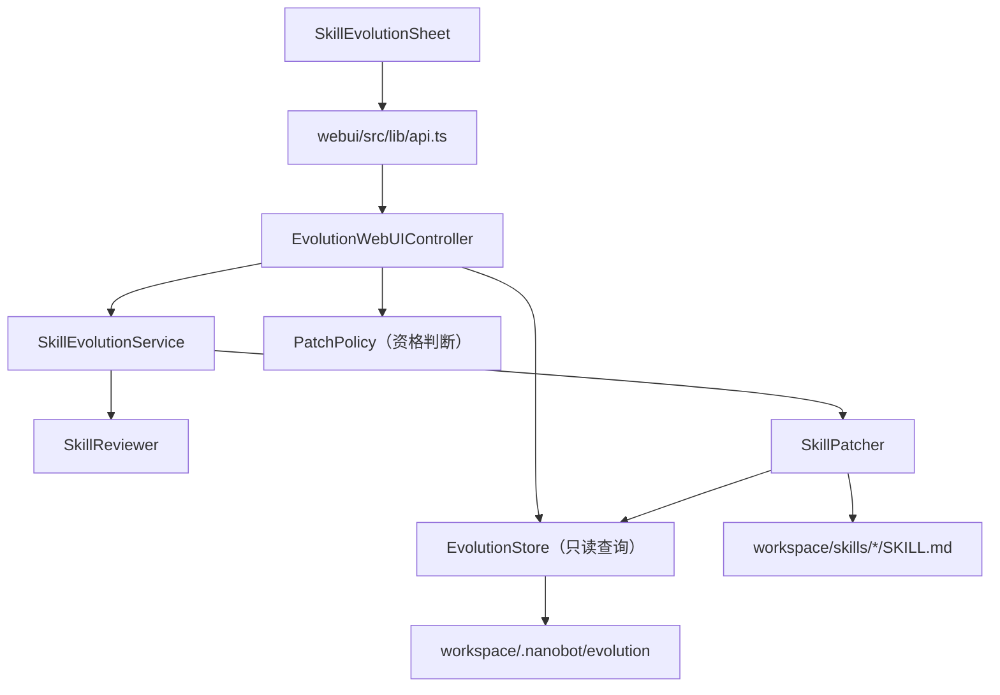
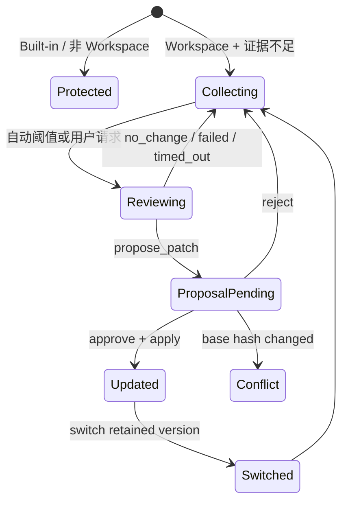

# NanoEvo WebUI 功能与接口设计

> 状态：已实现并通过契约测试（2026-07-26）
> 依赖：[UI 设计](./ui-design.md)
> 目标：为现有 NanoEvo 服务增加一个薄 WebUI 控制面，不复制进化逻辑，不让前端直接访问或修改 Skill 文件

## 1. 功能边界

### V1 包含

1. 查看全局进化配置和当前运行状态。
2. 查看全部 Skills 的保护状态、可进化状态和进度。
3. 查看单个 Workspace Skill 的最近 10 次脱敏轨迹摘要。
4. 用户提供可选反馈并请求复盘。
5. 查看待审核提案和文本差异。
6. 批准、拒绝提案。
7. 比较任意两个保留版本，并切换到指定版本。
8. 修改 `evolution.enabled` 和 `reviewModelPreset` 配置。

### V1 不包含

- 创建新 Skill。
- 修改内置 Skill。
- 自动批准提案。
- 展示完整 Thought/Chain-of-Thought。
- WebSocket 实时推送。
- Gateway 内热安装或热卸载进化 Hook。
- 新的进化算法或评测体系。

## 2. 依赖方向



约束：

- Controller 只做认证后的输入解析、DTO 组装、错误映射。
- 复盘、批准、拒绝、恢复必须调用 `SkillEvolutionService`。
- Controller 可以通过 `EvolutionStore` 做只读聚合，但不能写 Store。
- WebUI 不接收本地绝对路径，也不能指定任意文件。
- 所有可修改目标必须再次经过 `PatchPolicy.validate_target()`。

## 3. 后端集成方式

新增：

```text
nanobot/evolution/webui.py
└── EvolutionWebUIController
```

服务通过既有 Gateway 组合层注入：

```text
AgentLoop.skill_evolution
        ↓
ChannelManager（新增可选参数）
        ↓
build_gateway_services（转交，不创建服务）
        ↓
GatewayHTTPHandler
        ↓
EvolutionWebUIController
```

Gateway 命令当前先创建 Agent，再创建 `ChannelManager`，因此可以把 `agent.skill_evolution` 作为可选依赖向下传递。禁用 NanoEvo 时该值为 `None`，原 WebUI 行为不变。

建议的最小修改：

| 文件 | 修改 |
|---|---|
| `nanobot/evolution/webui.py` | 新增 WebUI Controller 和安全 DTO |
| `nanobot/cli/commands.py` | 创建 ChannelManager 时传入可选 evolution service |
| `nanobot/channels/manager.py` | 保存并转交可选 service |
| `nanobot/webui/gateway_services.py` | 将 service 传到 HTTP handler |
| `nanobot/webui/ws_http.py` | 增加一个可选子路由 dispatch |

不修改 `AgentRunner`、`SkillsLoader`、Hook 执行语义或 Proposal/Patcher 规则。

## 4. 前端集成方式

新增：

```text
webui/src/components/settings/
├── SkillEvolutionSheet.tsx
└── SkillEvolutionPanel.tsx

webui/src/hooks/
└── useSkillEvolution.ts
```

修改：

| 文件 | 修改 |
|---|---|
| `SkillsCatalogSettings.tsx` | 标题区增加“进化管理”按钮并挂载 Sheet |
| `webui/src/lib/api.ts` | 增加查询和动作函数 |
| `webui/src/lib/types.ts` | 增加 Evolution API 类型 |

不修改 `App.tsx`、Sidebar 路由、全局导航或全局 Token。

## 5. 状态模型



UI 派生状态不写回 Store，而是由 Controller 根据 Skill 来源、`SkillReviewState`、Proposal 和 Version 聚合产生。

## 6. API 约定

现有 Gateway HTTP 基于 `websockets.http11.Request`，当前路由没有通用请求体解析，且已有动作接口使用查询参数或自定义 Header。V1 为保持小改动，沿用这一约定：

- 所有接口使用现有 WebUI Token 认证。
- 查询接口是 GET。
- 动作接口暂时也是 GET，参数通过 URL 编码 JSON Header 传递。
- Header 名：`X-Nanobot-Evolution-Values`。
- 前端使用 `encodeURIComponent(JSON.stringify(values))` 编码。
- 将来 Gateway 支持标准请求体后，再迁移为 `POST/PATCH`；V1 不为追求 REST 形式扩张底层改造。

### 6.1 获取全局状态

`GET /api/webui/evolution`

响应：

```json
{
  "schema_version": 1,
  "enabled": true,
  "runtime_active": false,
  "restart_required": true,
  "review_every_n_trajectories": 10,
  "review_interval_options": [5, 10, 20, 100],
  "review_model_preset": null,
  "summary": {
    "total": 13,
    "evolvable": 2,
    "protected": 11,
    "reviewing": 0,
    "pending_proposals": 1
  },
  "skills": [
    {
      "name": "writing-assistant",
      "description": "Improve and structure writing",
      "source": "workspace",
      "available": true,
      "evolvable": true,
      "protection_reason": null,
      "state": "collecting",
      "trajectory_count": 7,
      "review_threshold": 10,
      "remaining_trajectories": 3,
      "review_running": false,
      "last_reviewed_at": null,
      "last_decision": null,
      "pending_proposal_count": 0,
      "current_version": "5bc1a894"
    }
  ]
}
```

说明：

- `total: 13`、`evolvable: 2` 是当前目标演示环境的预期值，不是写死常量。
- `review_threshold` 来源于当前 `review_every_n_trajectories` 配置。
- `review_interval_options` 是后端允许的固定策略集合，前端不自行构造任意值。
- `current_version` 仅返回当前 Skill 内容哈希的短前缀。
- 如果 NanoEvo 未安装，仍可根据 SkillsLoader 返回保护/资格信息；运行字段为空或为零。

### 6.2 获取 Skill 进化详情

`GET /api/webui/evolution/skills/{name}`

响应：

```json
{
  "skill": {
    "name": "writing-assistant",
    "source": "workspace",
    "available": true,
    "evolvable": true,
    "state": "proposal_pending",
    "trajectory_count": 10,
    "review_threshold": 10,
    "remaining_trajectories": 0,
    "last_reviewed_at": "2026-07-26T12:00:00.000Z",
    "last_decision": "propose_patch",
    "backup_available": false
  },
  "evidence": [
    {
      "trace_id": "tr_…",
      "created_at": "2026-07-26T11:40:00.000Z",
      "turn_id": "turn_…",
      "project_scope_hash": "2d184e1a4ec6b0e7",
      "task_excerpt": "Rewrite this Python project README…",
      "tool_calls": 3,
      "tool_errors": 0,
      "iterations": 4,
      "objective_failure": false,
      "stop_reason": "complete"
    }
  ],
  "pending_proposal": {
    "proposal_id": "pr_…",
    "skill_name": "writing-assistant",
    "reason": "Repeated evidence shows…",
    "status": "pending",
    "created_at": "2026-07-26T12:01:00.000Z",
    "base_hash": "5bc1a894…",
    "evidence_trace_ids": ["tr_…", "tr_…"],
    "patch": {
      "old_text": "Before text",
      "new_text": "After text"
    },
    "evidence_gates": {
      "trace_count": 2,
      "eligible": true
    }
  },
  "versions": [
    {
      "content_hash": "5bc1a894…",
      "proposal_id": "pr_…",
      "created_at": "2026-07-26T12:03:00.000Z",
      "is_current": true
    }
  ]
}
```

安全要求：

- `evidence` 最多返回最近 10 条。
- 只返回经过现有 redaction/truncation 后的摘要。
- 不返回原始 Workspace 路径、`chat_id`、`session_key`、密钥、完整工具结果或完整模型推理。
- `project_scope_hash` 是不可逆短哈希，不返回原路径。
- Built-in Skill 详情的 `evidence`、`pending_proposal`、`versions` 为空。

### 6.3 更新全局配置

`GET /api/webui/evolution/config/update`

Header：

```text
X-Nanobot-Evolution-Values:
%7B%22enabled%22%3Atrue%2C%22review_every_n_trajectories%22%3A10%2C%22review_model_preset%22%3Anull%7D
```

解码后的对象：

```json
{
  "enabled": true,
  "review_every_n_trajectories": 10,
  "review_model_preset": null
}
```

响应：

```json
{
  "ok": true,
  "enabled": true,
  "runtime_active": false,
  "restart_required": true,
  "review_every_n_trajectories": 10
}
```

Controller 通过现有配置保存能力更新 `evolution` 节点。启用/停用 Hook 和切换
Review 模型仍需要重启；复盘阈值会同步到活动 Service 并立即生效。

### 6.4 请求复盘

`GET /api/webui/evolution/skills/{name}/review`

Header 解码值：

```json
{
  "feedback": "请重点检查长文改写时是否保留用户语气"
}
```

调用：

```python
await service.request_review(
    skill_name=name,
    source_channel="webui",
    source_chat_id="skill-evolution",
    user_feedback=feedback,
)
```

响应：

```json
{
  "ok": true,
  "review_id": "rv_…",
  "state": "reviewing"
}
```

规则：

- Skill 必须是已有 Workspace Skill。
- 至少存在一条持久化轨迹。
- 用户反馈可为空；反馈用于帮助 Reviewer 聚焦，但不能替代真实轨迹。
- 同一 Skill 已在复盘时，沿用 Service 的 pending 队列语义。

### 6.5 批准提案

`GET /api/webui/evolution/proposals/{proposal_id}/approve`

调用 `service.approve_proposal(proposal_id)`。

响应：

```json
{
  "ok": true,
  "proposal_id": "pr_…",
  "status": "applied",
  "backup_created": true
}
```

若 `SKILL.md` 的当前哈希与提案 `base_hash` 不一致，返回 `409`，提案状态为 `conflict`，不得覆盖。

### 6.6 拒绝提案

`GET /api/webui/evolution/proposals/{proposal_id}/reject`

调用 `service.reject_proposal(proposal_id)`，返回最终状态 `rejected`。

### 6.7 比较版本

`GET /api/webui/evolution/skills/{name}/versions/compare`

Header 提交 `base_hash` 和 `target_hash`。Controller 只解析当前版本与该 Skill
已有备份，返回统一 Diff，不接收文件路径。

### 6.8 切换版本

`GET /api/webui/evolution/skills/{name}/versions/switch`

Header 提交 `target_hash`。调用 `service.switch_skill_version(name, target_hash)`；
切换前备份当前内容，目标必须是该 Workspace Skill 的完整保留版本哈希。

## 7. 错误语义

| HTTP 状态 | 场景 | UI 行为 |
|---|---|---|
| `400` | Header/字段格式错误 | 保留表单并指出字段问题 |
| `401` | Token 无效 | 走现有 WebUI 重新认证逻辑 |
| `404` | Skill、Proposal 或版本不存在 | 刷新数据并显示目标已变化 |
| `409` | 提案冲突、重复决定、复盘状态冲突 | 展示冲突说明，不重试写入 |
| `422` | 证据或 Patch 不满足策略 | 展示具体安全门禁原因 |
| `503` | 当前 Gateway 未启用 NanoEvo | 提示保存配置并重启 |
| `504` | 复盘超时 | 恢复请求按钮，保留已采集证据 |

错误响应统一：

```json
{
  "error": {
    "code": "evolution_policy_violation",
    "message": "At least one attributed persisted trajectory is required",
    "retryable": false
  }
}
```

## 8. 刷新策略

- Sheet 第一次打开时加载总览。
- 切换 Skill 时加载详情。
- 复盘处于 `reviewing` 时每 2 秒轮询该 Skill 详情。
- 复盘结束、关闭 Sheet 或组件卸载时停止轮询。
- 配置、批准、拒绝、切换版本成功后立即重新获取总览和当前详情。
- V1 不使用新的 WebSocket 事件，避免改变现有消息协议。

前端 Hook 必须捕获所有异步错误，并用稳定的 Skill 名称/Proposal ID 作为 React key。

## 9. 安全边界

1. 认证：所有 `/api/webui/evolution*` 路由必须通过现有 API Token 校验。
2. 目标限制：只接受 Skill 名称，由 `PatchPolicy` 解析；不接受文件路径。
3. Built-in 保护：后端必须强制拒绝，不能只依赖按钮禁用。
4. 人工批准：复盘只能生成 Proposal，不能直接应用。
5. 并发保护：批准时用 `base_hash` 防止覆盖用户后续编辑。
6. 持久化：继续使用原子写入、fsync 和版本备份。
7. 数据最小化：只向 UI 返回最近 10 条脱敏摘要。
8. 配置透明：`enabled` 与 `runtime_active` 分开，避免 UI 声称未生效功能已运行。

## 10. 测试契约

后端至少覆盖：

- 禁用时总览仍可读取，动作返回 `503`。
- 当前 13 个 Skill 能正确聚合为 2 个 Workspace 可进化、11 个 Built-in 受保护（使用测试夹具，不写死生产值）。
- Built-in 的 review/version switch 被 `422` 拒绝。
- Detail 最多返回 10 条轨迹且不含路径、密钥、完整 chat/session 字段。
- 请求复盘调用 Service 且不会直接产生文件修改。
- 批准创建备份并应用 Patch。
- base hash 冲突返回 `409` 且不覆盖文件。
- 拒绝和恢复映射到正确状态。
- Header 编码错误返回 `400`。
- 未认证请求返回 `401`。

前端至少覆盖：

- Sheet 打开、关闭和焦点恢复。
- 保护状态、进度、证据缺口、待审核数量渲染。
- 开关展示 `restart_required`。
- Reviewing 期间轮询，结束后停止。
- 批准/拒绝/恢复均有确认和错误展示。
- 移动端列表到详情的返回流程。
- 现有 Skills Catalog 测试保持通过。
