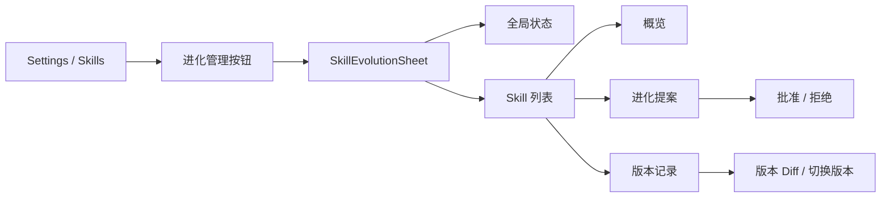

# NanoEvo Skills 进化管理 UI 设计

> 状态：已实现并通过回归验证（2026-07-26）
> 范围：在现有 WebUI 的 **Settings → Skills** 页面中增加 NanoEvo 管理入口
> 设计原则：复用现有视觉系统，以新增组件为主，不新增顶级路由，不改变原 Skills 浏览逻辑

## 1. 为什么需要这个界面

NanoEvo 已经能记录 Skill 使用轨迹、触发复盘、生成修改建议、人工批准并保存旧版本，但这些能力目前主要通过命令和本地文件暴露。WebUI 需要把这条链路变成一个容易理解的控制面：

1. 用户能确认进化功能是否启用、当前运行是否生效。
2. 用户能区分哪些 Skill 可以进化，哪些 Skill 受保护。
3. 用户能看见距离自动复盘条件还差多少。
4. 用户能主动请求复盘，但不能绕过证据与安全策略。
5. 用户能审核修改建议、批准或拒绝。
6. 用户能比较任意两个保留版本，并切换到指定版本。

这不是一个新的 Skill 编辑器。V1 仍然坚持 NanoEvo 的约束：**只改进已有 Workspace Skill，不生成新 Skill，不修改内置 Skill，不自动批准修改。**

## 2. Brownfield 路线结论

这是现有 React WebUI 上的增量功能，采用 Brownfield 路线：

- 保留 `SkillsCatalogSettings` 作为 Skills 页面所有者。
- 在页面标题区增加一个“进化管理”按钮。
- 点击后打开右侧 Sheet，不增加 Sidebar 菜单和新页面。
- 复用现有 `Button`、`Badge/Pill`、`Sheet`、`Tabs`、`Dialog`、`Progress`、Tooltip 和 Lucide 图标。
- 继承 `globals.css` 的语义色、圆角、字体与暗色模式。
- 不增加字体、UI 框架或运行时依赖。

选择 Sheet 而不是新路由，是因为“进化”是 Skill 的管理维度，不是与 Skills 并列的新业务模块；用户可以在保留 Skills 列表上下文的同时查看状态和处理提案。

## 3. 信息架构



Sheet 分为三层：

- 顶部：全局开关与运行状态。
- 左侧或上方：Skill 列表、筛选和进化进度。
- 主内容区：所选 Skill 的“概览 / 提案 / 版本”三个页签。

## 4. 桌面端原型

```text
┌──────────────────────── Settings / Skills ────────────────────────┐
│ Skills                                             [进化管理  2]  │
│ 浏览内置与 Workspace Skills                                      │
│                                                                  │
│ [All] [Workspace] [Built-in]     [搜索 Skill...]                 │
│ ┌──────────────────┐  ┌──────────────────┐                       │
│ │ writing-assistant│  │ ai-humanizer     │                       │
│ │ Workspace        │  │ Workspace        │                       │
│ └──────────────────┘  └──────────────────┘                       │
└──────────────────────────────────────────────────────────────────┘

                         右侧 Sheet
┌──────────────────────────────────────────────────────────────────┐
│ Skills 进化管理                                           [×]    │
│ 从真实使用轨迹中改进已有 Workspace Skills                        │
│                                                                  │
│ ┌──────────────────────────────────────────────────────────────┐ │
│ │ 进化功能                 配置：开启  运行：未生效   [开关]   │ │
│ │ 自动复盘：[每 10 次 ▼]   复盘模型：[当前主模型 ▼]   [保存]   │ │
│ │ 启用状态或复盘模型变更后需要重启 Gateway                     │ │
│ └──────────────────────────────────────────────────────────────┘ │
│                                                                  │
│ 2 可进化   11 受保护   1 待审核                                 │
│                                                                  │
│ Skill 列表                         当前：writing-assistant       │
│ ┌──────────────────────┐          [概览] [提案 1] [版本]         │
│ │ writing-assistant    │          ┌────────────────────────────┐ │
│ │ 收集中 7/10      70% │          │ 自动复盘进度                │ │
│ ├──────────────────────┤          │ 7 / 10 条有效轨迹           │ │
│ │ ai-humanizer         │          │ 还需 3 条轨迹               │ │
│ │ 待审核           ●   │          │ 证据策略 已满足             │ │
│ │ github               │          │                            │ │
│ │ 内置 · 受保护        │          │ [填写反馈并请求复盘]        │ │
│ └──────────────────────┘          └────────────────────────────┘ │
└──────────────────────────────────────────────────────────────────┘
```

## 5. 移动端原型

宽度小于 `768px` 时 Sheet 占满屏幕。列表和详情不并排展示，改为：

```text
┌──────────────────────────────┐
│ ← Skills 进化管理            │
│ [进化已开启 · 重启后生效]    │
│                              │
│ [全部] [可进化] [待处理]     │
│ ┌──────────────────────────┐ │
│ │ writing-assistant       ›│ │
│ │ 收集中 7/10              │ │
│ └──────────────────────────┘ │
│ ┌──────────────────────────┐ │
│ │ github                  ›│ │
│ │ 内置 · 受保护            │ │
│ └──────────────────────────┘ │
└──────────────────────────────┘

点击 Skill 后：

┌──────────────────────────────┐
│ ← writing-assistant          │
│ [概览] [提案 1] [版本]       │
│                              │
│ 自动复盘进度                 │
│ ███████░░░  7 / 10          │
│ 还需 3 条有效轨迹            │
│                              │
│ [请求复盘]                   │
└──────────────────────────────┘
```

## 6. 核心界面状态

### 6.1 全局状态

全局卡片必须同时显示两个概念：

| 字段 | UI 文案示例 | 含义 |
|---|---|---|
| `enabled` | 配置已开启 | 配置文件中的目标状态 |
| `runtime_active` | 当前运行中 | 当前 Gateway 是否已安装 NanoEvo 服务 |
| `restart_required` | 重启后生效 | 配置与当前运行状态不一致 |

V1 不伪装成热切换。切换开关后保存配置；如果运行状态尚未变化，明确显示“需要重启 Gateway”。

### 6.2 Skill 状态

| 状态 | 中文标签 | 表现 |
|---|---|---|
| `protected` | 受保护 | 中性锁图标，隐藏复盘和修改按钮 |
| `eligible` | 可进化 | 可请求复盘 |
| `collecting` | 收集中 `7/10` | 显示进度和剩余轨迹数 |
| `reviewing` | 正在复盘 | Spinner，并临时禁用重复请求 |
| `proposal_pending` | 待审核 | 强调色圆点和提案数量 |
| `updated` | 已更新 | 成功状态和更新时间 |
| `conflict` | 发生冲突 | 警告状态，解释 Skill 已在提案后变化 |
| `unavailable` | 当前不可用 | 保留原 Skills 页不可用原因 |

状态不能只靠颜色表达，必须同时显示文字或图标。

### 6.3 概览页签

Workspace Skill 显示：

- 当前是否可进化以及原因。
- 当前累计轨迹数、自动复盘阈值、剩余数量。
- 最近一次复盘时间和结论。
- 当前是否存在待审核提案。
- “请求复盘”入口和可选反馈文本框。

内置 Skill 显示：

> 这是 nanobot 内置 Skill。NanoEvo V1 只改进 Workspace Skills，因此它会被永久保护。

不显示假进度，也不提供解锁按钮。

### 6.4 提案页签

一个 Skill 在 V1 最多显示一个待审核提案：

```text
为什么建议修改
过去的轨迹多次显示：处理长文时没有先识别用户希望保留的表达风格。

证据条件
✓ 至少 1 条可归因的真实执行轨迹
✓ 未包含密钥与绝对路径

修改对比
− 修改前文本
+ 修改后文本

[拒绝]                                         [批准并应用]
```

批准前弹出确认对话框，说明：

- 只会修改此 Workspace Skill 的 `SKILL.md`。
- 修改前内容会被永久备份。
- 如果文件在提案生成后发生变化，系统会拒绝覆盖并标记冲突。

拒绝需要二次确认，但不要求填写理由。操作成功后刷新概览、提案和版本。

### 6.5 版本页签

显示：

- 当前版本摘要。
- 每次被替换前保存的历史版本：时间、内容哈希前 8 位、来源提案。
- 任意两个保留版本的统一 Diff。
- 当前版本标识，以及切换到任意历史版本的确认操作。

切换版本前必须确认。系统先备份当前内容，再原子写入目标版本，因此后续仍可切换回来。

## 7. 视觉规范

### 7.1 继承现有风格

- 背景、边框、文字、强调色全部使用现有语义 Token。
- 继续使用系统字体和现有字号层级。
- 卡片圆角与 Skills 页一致，约 `14–18px`。
- 图标使用 `lucide-react`：`BrainCircuit`、`ShieldCheck`、`History`、`GitCompare`、`RefreshCw`、`LockKeyhole`。
- 动画保持 `150–300ms`，支持 `prefers-reduced-motion`。

明确不采用：

- 独立“AI 紫色”主题。
- 新渐变背景、玻璃拟态或大面积高饱和色。
- 新字体和新图标库。
- 与现有 Settings 页面不一致的 Dashboard 布局。

### 7.2 内容语气

文案应解释事实，不暗示模型真的完成了训练：

- 使用“复盘”“修改建议”“应用修改”，避免“训练完成”。
- 使用“还需 3 条轨迹”，避免“经验不足”这种模糊提示。
- 使用“受保护”，避免“无法进化”造成故障感。
- 使用“切换到此版本”，并明确当前版本会先备份，避免误解为破坏性覆盖。

## 8. 交互与可访问性

- 所有点击目标至少 `44 × 44px`。
- Sheet 打开后焦点进入标题，关闭后回到“进化管理”按钮。
- Tab 使用 `role="tablist"` 和键盘左右键切换。
- 进度条包含可读的 `aria-valuenow`、`aria-valuemin`、`aria-valuemax`。
- 异步成功/失败消息放入 `aria-live="polite"` 区域。
- 批准、拒绝、比较和切换版本均可通过键盘完成。
- 错误信息不能只放在 Toast 中，操作区域保留可读错误。
- 320px 宽度下不得横向溢出；Diff 长行换行，代码字体区域可局部滚动。
- 复盘运行时只禁用相关 Skill 的动作，不锁死整个 Sheet。

## 9. 空态与异常态

| 场景 | 展示 |
|---|---|
| NanoEvo 未启用 | 解释功能并提供开关，Skill 状态仍可浏览 |
| 没有 Workspace Skill | “添加 Workspace Skill 后可积累进化轨迹” |
| 没有轨迹 | `0/10`，请求复盘按钮禁用并解释原因 |
| 没有提案 | “最近一次复盘未发现需要修改的内容”或“尚未复盘” |
| 复盘超时 | 保留失败状态，允许再次请求 |
| 提案冲突 | 不覆盖文件，提示重新复盘 |
| API 不可用 | Skills 原列表继续工作，进化 Sheet 显示独立错误 |

## 10. UI 验收清单

- [ ] Skills 原列表、搜索、详情 Sheet 行为不变。
- [ ] “进化管理”入口不会挤压移动端标题。
- [ ] 内置 Skill 均显示“受保护”，且无修改动作。
- [ ] Workspace Skill 能显示准确的轨迹进度和证据缺口。
- [ ] 配置状态与当前运行状态分开展示。
- [ ] 复盘、批准、拒绝、恢复都有加载、成功和失败状态。
- [ ] Diff 能清楚区分删除和新增内容，暗色模式仍可读。
- [ ] 320px、390px、768px 和桌面宽度无页面级横向滚动。
- [ ] 键盘、焦点、屏幕阅读器状态完整。
- [ ] 不引入新依赖，不覆盖现有全局视觉 Token。
